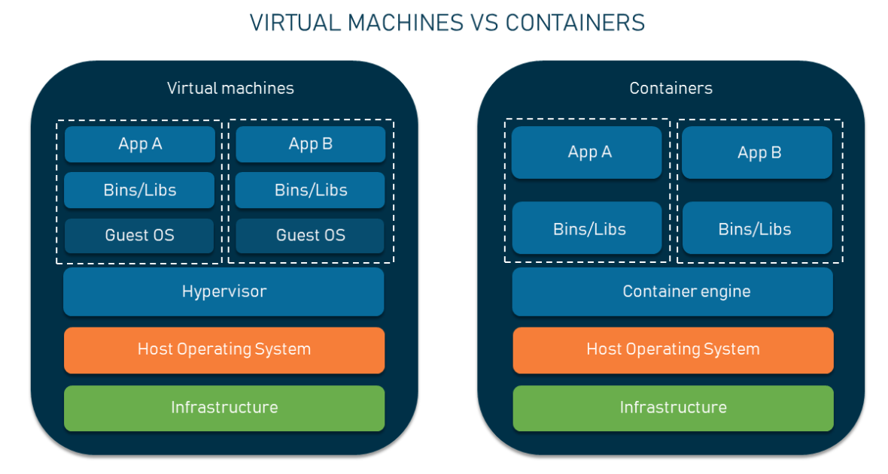
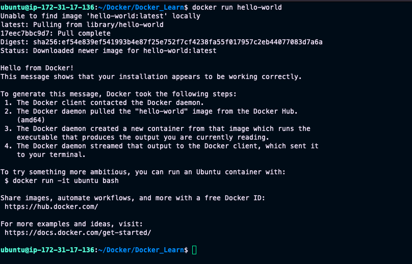

# Day 29 – Introduction to Docker

## Task 1: What is Docker?

- Containers package code, libraries, and dependencies into one portable unit that runs anywhere consistently. We need them to fix "it works on my machine" issues, speed up deployments, save resources, and scale easily without conflicts.

- VMs run full guest OS on virtual hardware (heavy, slow start), while containers share the host OS kernel (lightweight, instant start, less memory).

- Docker architecture: Client (CLI sends commands) → Daemon (dockerd manages everything on host) → Images (templates) → Containers (running instances). Registry (Docker Hub) stores/shares images.

- My Simple Docker Flow: User types docker run nginx → Client asks Daemon → Daemon pulls Image from Registry → Daemon starts Container on host kernel. Like a chef (daemon) grabbing recipe (image) from cookbook (registry) to cook meal (container).

**Architecture**



---

### Containers vs Virtual Machines

| Feature | Containers | Virtual Machines |
|------|------|------|
| Size | Small and lightweight | Large and heavy |
| Startup | Seconds | Minutes |
| OS | Share host OS | Full OS |
| Performance | Fast | Slower |
| Resource usage | Low | High |

Containers use the host OS kernel, while VMs need a full operating system.

---

### Why containers are important in DevOps?

Containers are widely used because:
- They support CI/CD pipelines
- Used in microservices architecture
- Required for Kubernetes
- Help in cloud-native applications
- Easy to scale and deploy

---

## Task 2: Docker Architecture

Docker follows a **client-server architecture**.

### Components I learned:

1. **Docker Client**
   - Command-line interface (CLI)
   - Used to run Docker commands.

2. **Docker Daemon**
   - Runs in the background.
   - Manages containers and images.

3. **Docker Images**
   - Templates used to create containers.

4. **Docker Containers**
   - Running instances of images.

5. **Docker Registry**
   - Storage for Docker images.
   - Example: Docker Hub.

---

### My understanding of Docker architecture

**When I run:**

```bash
docker run nginx
```
The process:
- Docker client sends the request.
- Docker daemon checks for the image.
- If not present, it pulls from Docker Hub.
- Then it creates and starts the container.

**I understood this like:**
Images = Recipe
Containers = Ready food

---

## Task 3: Install Docker

I installed Docker on my system.
To verify:
```bash
docker --version
```
- Run hello-world container

```bash
docker run hello-world
```
**This command:**
- Pulled the image
- Created a container
- Ran the program
- Displayed a success message

Screenshot attached.


## Task 4: Run Real Containers
Run Nginx container
```bash
docker run -d -p 8080:80 nginx
```
- I accessed it in the browser: http://localhost:8080
- I saw the Nginx welcome page.

Screenshot attached.


Run Ubuntu in interactive mode
```bash
docker run -it ubuntu bash
```
I explored:
- Linux commands
- File system
- Installed packages
- It felt like using a small Linux machine.

1. List running containers -> `docker ps`
2. List all containers -> `docker ps -a`
3. Stop container -> `docker stop <container_id>`
4. Remove container -> `docker rm <container_id>`

---

## Task 5: Explore Docker

1. **Detached mode**
```bash
docker run -d nginx
```
- The container runs in the background.

2. **Custom container name**
```bash
docker run -d --name my-nginx nginx
```

3. **Port mapping**
```bash 
docker run -d -p 8081:80 nginx
```
4. **Check logs**
```bash
docker logs my-nginx
```
5. **Execute command inside container**
```bash
docker exec -it my-nginx bash
```