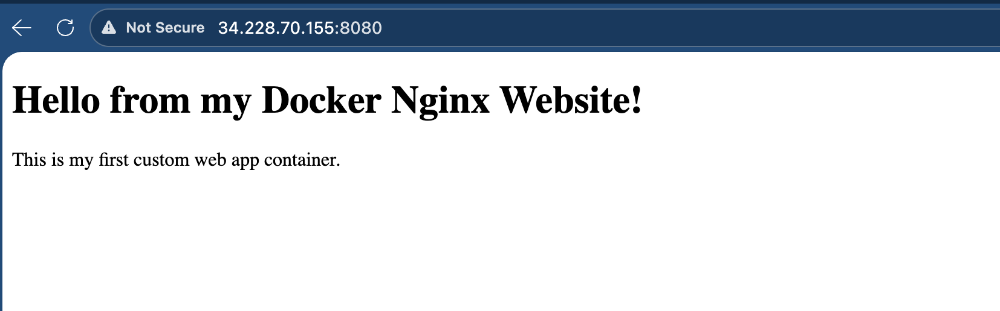

# Day 31 – Dockerfile: Build Your Own Images

## Task 1: Your First Dockerfile

Today I created my first Dockerfile and built a custom Docker image.

---

### Project setup

1. I created a project folder:

```bash
mkdir my-first-image
cd my-first-image
```

2. Created Dockerfile: 

```bash
ubuntu@ip-172-31-17-136:~/Docker/project/my-first-image$ cat Dockerfile
FROM ubuntu:latest

RUN apt-get update && apt-get install -y curl

CMD ["echo", "Hello from my custom image!"]
```

3. Build the image and tag it `my-ubuntu:v1`

```
ubuntu@ip-172-31-17-136:~/Docker/project/my-first-image$ docker build -t my-ubuntu:v1 .
Step 3/3 : CMD ["echo", "Hello from my custom image!"]
 ---> Running in 6266d6af8879
 ---> Removed intermediate container 6266d6af8879
 ---> 9f007f7eb663
Successfully built 9f007f7eb663
Successfully tagged my-ubuntu:v1
```


4. Run a container from your image

```bash 
ubuntu@ip-172-31-17-136:~/Docker/project/my-first-image$ docker run my-ubuntu:v1
Hello from my custom image!
```

## Task 2: Dockerfile Instructions

In this task, I used important Dockerfile instructions like FROM, RUN, COPY, WORKDIR, EXPOSE, and CMD.

---

### Project setup

1. I created a new folder and sample file.

```bash
mkdir dockerfile-task2
cd dockerfile-task2
touch app.txt
```
Created Dockerfile:

```bash 
ubuntu@ip-172-31-17-136:~/Docker/project/dockerfile-task2$ cat Dockerfile
FROM ubuntu:latest
RUN apt-get update && apt-get install -y curl
WORKDIR /app
COPY app.txt .
EXPOSE 8080
CMD ["cat", "app.txt"]
````

2. build : 
```bash
ubuntu@ip-172-31-17-136:~/Docker/project/dockerfile-task2$ docker build -t my-dockerfile:v1
Running hooks in /etc/ca-certificates/update.d...
done.
 ---> Removed intermediate container e622f16567b2
 ---> 39133ed68bd5
Step 3/6 : WORKDIR /app
 ---> Running in fb5446481112
 ---> Removed intermediate container fb5446481112
 ---> 52e78b48f0f6
Step 4/6 : COPY app.txt .
 ---> 2ce4850cf4ec
Step 5/6 : EXPOSE 8080
 ---> Running in fd712ed43d2b
 ---> Removed intermediate container fd712ed43d2b
 ---> 55a2cf3d0c1c
Step 6/6 : CMD ["cat", "app.txt"]
 ---> Running in aeafe45d1e11
 ---> Removed intermediate container aeafe45d1e11
 ---> 890d8d62d3ad
Successfully built 890d8d62d3ad
Successfully tagged my-dockerfile:v1
```
**Observation:**
- Docker pulled the Ubuntu image.
- Installed curl.
- Copied the file.
- Created the image successfully.

Docker Run : 
```bash 
ubuntu@ip-172-31-17-136:~/Docker/project/dockerfile-task2$ docker run my-dockerfile:v1
Hello! , from Docker file.
```

### Understanding Each Instruction

- FROM: Used to define the base image for the container.
- RUN: Executes commands during the build process.
- COPY: Copies files from the host system to the container.
- WORKDIR: Sets the working directory inside the container.
- EXPOSE: Documents the port that the container will use.
- CMD: Defines the default command that runs when the container starts.

## Task 3: CMD vs ENTRYPOINT

In this task, I explored the difference between **CMD** and **ENTRYPOINT** in Docker and understood how they behave when running containers.

### 1. Create an image with `CMD ["echo", "hello"

```bash 
ubuntu@ip-172-31-17-136:~/Docker/project/dockerfile-task2$ docker run cmd-test:v1
hello
ubuntu@ip-172-31-17-136:~/Docker/project/dockerfile-task2$ docker run cmd-test:v1 echo "custom message"
custom message
ubuntu@ip-172-31-17-136:~/Docker/project/dockerfile-task2$ cat Dockerfile
FROM ubuntu:latest
CMD ["echo", "hello"]
```

### 2. Create an image with `ENTRYPOINT ["echo"]`
```bash 
ubuntu@ip-172-31-17-136:~/Docker/project/dockerfile-task2$ docker run entrypoint-test:v2 hello
hello
ubuntu@ip-172-31-17-136:~/Docker/project/dockerfile-task2$ cat Dockerfile
FROM ubuntu:latest
ENTRYPOINT ["echo"]
```


### 3. CMD vs ENTRYPOINT (Short Notes)

**CMD:**
- Used to set a default command.
- Can be overridden at runtime.
- Best when flexibility is needed.

**ENTRYPOINT:**
- Used to define the main application.
- Cannot be easily overridden.
- Best for production and fixed containers.

**In short:**
CMD = Default and flexible  
ENTRYPOINT = Fixed and always runs

## Task 4: Build a Simple Web App Image

In this task, I created a simple static website and containerized it using Docker and Nginx.

---


### Step 1: Create Dockerfile

I created a Dockerfile using Nginx Alpine as the base image.
```
FROM nginx:alpine
COPY index.html /usr/share/nginx/html/
```
Explanation:
- FROM nginx:alpine → Uses lightweight Nginx image.
- COPY index.html /usr/share/nginx/html/ → Copies the HTML file to Nginx default web directory.

### Step 2 : Build the Docker Image
```
docker build -t my-website:v1 .
```

### Step 3: Run the Container with Port Mapping

```
docker run -d -p 8080:80 my-website:v1
```
Explanation:
*-d* → Runs container in detached mode.
*-p* 8080:80 → Maps host port 8080 to container port 80.




## Task 5: .dockerignore

### Step 1: Create .dockerignore file

```bash
ubuntu@ip-172-31-17-136:~/Docker/project/website$ cat .dockerignore
node_modules
.git
*.md
.env
```
### Step 2: Build the image
`docker build -t ignore-test:v1 .`

### Step 3: Verify
```bash
ubuntu@ip-172-31-17-136:~/Docker/project/website$ docker run -it ignore-test:v1 bash
/docker-entrypoint.sh: exec: line 47: bash: not found
ubuntu@ip-172-31-17-136:~/Docker/project/website$ ls
Dockerfile  index.html
ubuntu@ip-172-31-17-136:~/Docker/project/website$ ls -a
.  ..  .dockerignore  Dockerfile  index.html
ubuntu@ip-172-31-17-136:~/Docker/project/website$ docker run -it ignore-test:v1 sh
/ # ls -a
.                     bin                   docker-entrypoint.sh  lib                   opt                   run                   sys                   var
..                    dev                   etc                   media                 proc                  sbin                  tmp
.dockerenv            docker-entrypoint.d   home                  mnt                   root                  srv                   usr
/ # exit
```
Ignored files were not present inside the container.


## Task 6: Build Optimization

### Step 1: Build and rebuild image

I built the Docker image, then changed one line in the Dockerfile and rebuilt it.

```bash
docker build -t optimize-test:v1 .
```
**Observation:**
- Docker reused cached layers.
- Only the changed layer was rebuilt.

### Step 2: Reorder Dockerfile

I reordered the Dockerfile so that frequently changing instructions (like COPY or application code) come at the end.
Example:
```bash
FROM ubuntu:latest
RUN apt-get update && apt-get install -y curl
WORKDIR /app
COPY . .
CMD ["echo", "Build optimized"]
```
### Step 3: Why layer order matters?
- Docker uses caching for each layer.
- If an early layer changes, all later layers rebuild.
- Placing stable layers first improves build speed.
- This makes CI/CD pipelines faster and more efficient.