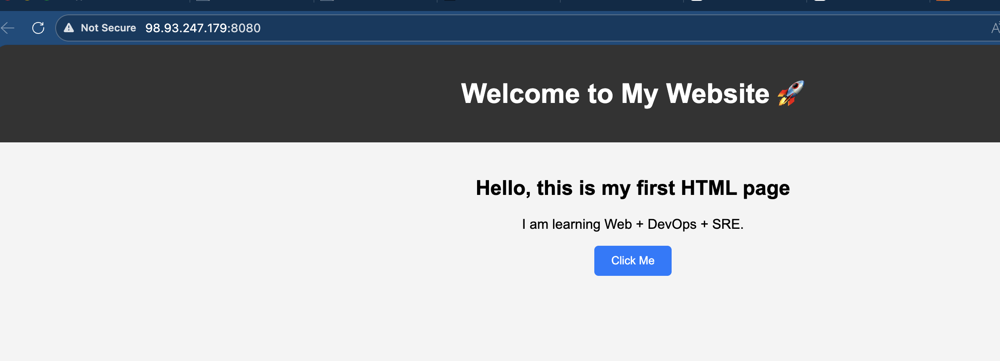

# Day 32 – Docker Volumes & Networking

## Task 1: The Problem
### 1. Run MySQL container
```bash
ubuntu@ip-172-31-17-136:~/Docker/SQLDB_project_volume$ docker run -d --name mysql-demo -e MYSQL_ROOT_PASSWORD=root -p 3306:3306 mysql:latest
```

### 2. Create some data inside it (a table, a few rows — anything)

```bash 
ubuntu@ip-172-31-17-136:~/Docker/SQLDB_project_volume$ docker exec -it mysql-demo mysql -uroot -p
Enter password:
Welcome to the MySQL monitor.  Commands end with ; or \g.
Your MySQL connection id is 9
Server version: 9.6.0 MySQL Community Server - GPL

Copyright (c) 2000, 2026, Oracle and/or its affiliates.

Oracle is a registered trademark of Oracle Corporation and/or its
affiliates. Other names may be trademarks of their respective
owners.

Type 'help;' or '\h' for help. Type '\c' to clear the current input statement.

mysql> CREATE DATABASE testdb;
mysql> show databases;
+--------------------+
| Database           |
+--------------------+
| information_schema |
| mysql              |
| performance_schema |
| sys                |
| testdb             |
+--------------------+
5 rows in set (0.001 sec)

mysql> use testdb;
Database changed
mysql> CREATE TABLE users (   id INT,   name VARCHAR(50) );
Query OK, 0 rows affected (0.046 sec)

mysql> INSERT INTO users VALUES (1, 'Nilamadhab');
Query OK, 1 row affected (0.016 sec)

mysql> INSERT INTO users VALUES (2, 'DevOps');
Query OK, 1 row affected (0.005 sec)

mysql> SELECT * FROM users;
+------+------------+
| id   | name       |
+------+------------+
|    1 | Nilamadhab |
|    2 | DevOps     |
+------+------------+
2 rows in set (0.000 sec)
```

### 3. Stop and remove the container
```bash 
ubuntu@ip-172-31-17-136:~/Docker/SQLDB_project_volume$ docker ps
CONTAINER ID   IMAGE          COMMAND                  CREATED         STATUS         PORTS                                                    NAMES
a6a2801c5bd6   mysql:latest   "docker-entrypoint.s…"   4 minutes ago   Up 4 minutes   0.0.0.0:3306->3306/tcp, [::]:3306->3306/tcp, 33060/tcp   mysql-demo
ubuntu@ip-172-31-17-136:~/Docker/SQLDB_project_volume$ docker stop a6 && docker rm a6
a6
a6
```

### 4. Run a new one — is your data still there?

```bash 
ubuntu@ip-172-31-17-136:~/Docker/SQLDB_project_volume$ docker run -d --name mysql-demo -e MYSQL_ROOT_PASSWORD=root -p 3306:3306 mysql:latest
4d7604de7b9b0131dac731fe75acc394fe3730e8bead46f0a118c99409dc391b
ubuntu@ip-172-31-17-136:~/Docker/SQLDB_project_volume$
ubuntu@ip-172-31-17-136:~/Docker/SQLDB_project_volume$ docker exec -it mysql-demo mysql -uroot -p
Enter password:
ERROR 1045 (28000): Access denied for user 'root'@'localhost' (using password: YES)
ubuntu@ip-172-31-17-136:~/Docker/SQLDB_project_volume$ docker exec -it mysql-demo mysql -uroot -p
Enter password:
Welcome to the MySQL monitor.  Commands end with ; or \g.
Your MySQL connection id is 9
Server version: 9.6.0 MySQL Community Server - GPL

Copyright (c) 2000, 2026, Oracle and/or its affiliates.

Oracle is a registered trademark of Oracle Corporation and/or its
affiliates. Other names may be trademarks of their respective
owners.

Type 'help;' or '\h' for help. Type '\c' to clear the current input statement.

mysql> show databases;
+--------------------+
| Database           |
+--------------------+
| information_schema |
| mysql              |
| performance_schema |
| sys                |
+--------------------+
4 rows in set (0.020 sec)

mysql> use testdb;
ERROR 1049 (42000): Unknown database 'testdb'
```
### **Issue Faced**

While creating the table, I got the error "No database selected".
**Reason:**
- I forgot to select the database before creating the table.
**Fix:**
- Used `USE testdb;` before creating the table.
**Learning:**
- In MySQL, we must select a database before creating tables.

---

## Task 2: Named Volumes
### 1. Create a named volume
```bash 
ubuntu@ip-172-31-17-136:~/Docker/SQLDB_project_volume$ docker volume create mysql-data
mysql-data
ubuntu@ip-172-31-17-136:~/Docker/SQLDB_project_volume$ docker volume ls
DRIVER    VOLUME NAME
local     9f9a4882a6e9c8a18679d1a31ed49b90813b777c7cb9e617b48cbbac3c2c0c3a
local     50905062a545f157300df40d99b4aaac7ba92779da5ef179339dce128f1b4ce6
local     mysql-data
ubuntu@ip-172-31-17-136:~/Docker/SQLDB_project_volume$ docker volume inspect mysql-data #we can see the details of Volume 
[
    {
        "CreatedAt": "2026-02-24T12:28:13Z",
        "Driver": "local",
        "Labels": null,
        "Mountpoint": "/var/lib/docker/volumes/mysql-data/_data",
        "Name": "mysql-data",
        "Options": null,
        "Scope": "local"
    }
]

```
### 2. Run the same database container, but this time **attach the volume** to it

```bash 
ubuntu@ip-172-31-17-136:~/Docker/SQLDB_project_volume$ docker run -d --name mysql-demo -e MYSQL_ROOT_PASSWORD=root -v mysql-data:/var/lib/mysql -p 3306:3306 mysql:latest
e3df2820a4fb10c439293ce5f70678840dc077bc6a707a50016aee460129413e
```
- stop and remove previous container and creating new with adding volume : `-v mysql-data:/var/lib/mysql`
### 3. Add some data, stop and remove the container
```bash 
ubuntu@ip-172-31-17-136:~/Docker/project$ docker run -d --name mysql-demo -e MYSQL_ROOT_PASSWORD=root -v mysql-data:/var/lib/mysql -p 3306:3306 mysql:latest
101d08a1b172bfd62981dff8b7d6de4f9c49432c63101ce124af6bbfa5d16c6b
ubuntu@ip-172-31-17-136:~/Docker/project$ docker exec -it 101 bash
bash-5.1# mysql -uroot -p
Enter password:
Welcome to the MySQL monitor.  Commands end with ; or \g.
Your MySQL connection id is 9
Server version: 9.6.0 MySQL Community Server - GPL

Copyright (c) 2000, 2026, Oracle and/or its affiliates.

Oracle is a registered trademark of Oracle Corporation and/or its
affiliates. Other names may be trademarks of their respective
owners.

Type 'help;' or '\h' for help. Type '\c' to clear the current input statement.

mysql> show datrabases;
ERROR 1064 (42000): You have an error in your SQL syntax; check the manual that corresponds to your MySQL server version for the right syntax to use near 'datrabases' at line 1
mysql> show databases;
+--------------------+
| Database           |
+--------------------+
| information_schema |
| mysql              |
| performance_schema |
| sys                |
| test_db            |
+--------------------+
5 rows in set (0.020 sec)

mysql> use testdb;
ERROR 1049 (42000): Unknown database 'testdb'
mysql> use test_db;
Reading table information for completion of table and column names
You can turn off this feature to get a quicker startup with -A

Database changed
mysql> select * from users;
+------+------------+
| id   | name       |
+------+------------+
|    1 | Nilamadhab |
|    2 | DevOps     |
+------+------------+
2 rows in set (0.004 sec)
```


### 4. Run a brand new container with the **same volume**

```bash 
ubuntu@ip-172-31-17-136:~/Docker/project$ docker stop 101 && docker rm 101
101
101
ubuntu@ip-172-31-17-136:~/Docker/project$ docker run -d --name mysql-demo -e MYSQL_ROOT_PASSWORD=root -v mysql-data:/var/lib/mysql -p 3306:3306 mysql:latest
b0c5231de46055c3bc1ae25d559e55736701d7bd0ee09f8e1779f8585198a853
ubuntu@ip-172-31-17-136:~/Docker/project$ docker exec -it b0c bash
bash-5.1# mysql -uroot -p
Enter password:
Welcome to the MySQL monitor.  Commands end with ; or \g.
Your MySQL connection id is 9
Server version: 9.6.0 MySQL Community Server - GPL

Copyright (c) 2000, 2026, Oracle and/or its affiliates.

Oracle is a registered trademark of Oracle Corporation and/or its
affiliates. Other names may be trademarks of their respective
owners.

Type 'help;' or '\h' for help. Type '\c' to clear the current input statement.

mysql> showdatabases;
ERROR 1064 (42000): You have an error in your SQL syntax; check the manual that corresponds to your MySQL server version for the right syntax to use near 'showdatabases' at line 1
mysql> show databases;
+--------------------+
| Database           |
+--------------------+
| information_schema |
| mysql              |
| performance_schema |
| sys                |
| test_db            |
+--------------------+
5 rows in set (0.018 sec)

mysql> use test_db;
Reading table information for completion of table and column names
You can turn off this feature to get a quicker startup with -A

Database changed
mysql> select * from users;
+------+------------+
| id   | name       |
+------+------------+
|    1 | Nilamadhab |
|    2 | DevOps     |
+------+------------+
2 rows in set (0.009 sec)
```

### 5. Is the data still there?
- The data was still present in the new container.

**Verify:** `docker volume ls`, `docker volume inspect`

```bash
ubuntu@ip-172-31-17-136:~/Docker/project$ docker volume ls
DRIVER    VOLUME NAME
local     9f9a4882a6e9c8a18679d1a31ed49b90813b777c7cb9e617b48cbbac3c2c0c3a
local     50905062a545f157300df40d99b4aaac7ba92779da5ef179339dce128f1b4ce6
local     mysql-data
ubuntu@ip-172-31-17-136:~/Docker/project$ docker volume inspect
docker: 'docker volume inspect' requires at least 1 argument

Usage:  docker volume inspect [OPTIONS] VOLUME [VOLUME...]

See 'docker volume inspect --help' for more information
ubuntu@ip-172-31-17-136:~/Docker/project$ docker volume inspect mysql-data
[
    {
        "CreatedAt": "2026-02-24T12:28:13Z",
        "Driver": "local",
        "Labels": null,
        "Mountpoint": "/var/lib/docker/volumes/mysql-data/_data",
        "Name": "mysql-data",
        "Options": null,
        "Scope": "local"
    }
] 
```

**Observation**
- The data was not lost even after deleting the container.
**Reason**
- Named volumes store data outside the container filesystem, so data remains even when containers are removed.

---

## Task 3: Bind Mounts

### Step 1: Create folder and index.html

```bash
ubuntu@ip-172-31-17-136:~/Docker/project/website-bind$ ls
index.html
```
Added simple HTML content inside index.html.


### Step 2: Run Nginx with bind mount
```bash 
docker run -d --name nginx-bind \
-p 8080:80 \
-v $(pwd):/usr/share/nginx/html \
nginx:alpine
```

### Step 3: Access in browser
Opened in browser:

The custom webpage was displayed.


### Step 4: Edit index.html and refresh

I edited the index.html file on the host machine and refreshed the browser.
The changes were reflected immediately.



### Difference between Named Volume and Bind Mount

**Named Volume:**
- Managed by Docker.
- Used for persistent storage like databases.
- Stored in Docker's internal directory.
**Bind Mount:**
- Directly links a host folder to the container.
- Useful for development.
- Changes on the host reflect immediately in the container.

---

## Task 4: Docker Networking Basics

### Step 1: List all Docker networks

```bash
ubuntu@ip-172-31-17-136:~/Docker/project/website-bind$ docker network ls
NETWORK ID     NAME      DRIVER    SCOPE
ca7214bd2df2   bridge    bridge    local
478f1c7a2787   host      host      local
9f3e969f2a28   none      null      local
```
- I saw the default networks like bridge, host, and none.


### Step 2: Inspect the default bridge network
`docker network inspect bridge` This showed details like:
- Network ID
- Subnet
- Connected containers
```bash 
ubuntu@ip-172-31-17-136:~/Docker/project/website-bind$ docker network inspect bridge
[
    {
        "Name": "bridge",
        "Id": "ca7214bd2df254714bf0a91359c6e75f62488a9c51c2648fbce307494ce68383",
        "Created": "2026-02-24T12:11:06.540922256Z",
        "Scope": "local",
        "Driver": "bridge",
        "EnableIPv4": true,
        "EnableIPv6": false,
        "IPAM": {
            "Driver": "default",
            "Options": null,
            "Config": [
                {
                    "Subnet": "172.17.0.0/16",
                    "Gateway": "172.17.0.1"
                }
            ]
        },
        "Internal": false,
        "Attachable": false,
        "Ingress": false,
        "ConfigFrom": {
            "Network": ""
        },
        "ConfigOnly": false,
        "Containers": {
            "796e1c6bf121d04f1fd898b670786654f81d936dfefe560c9e52f86259eca7b1": {
                "Name": "nginx-bind",
                "EndpointID": "2c0ddcec89456ba5e8dbe6b0c990b16d9cdf3fb52a9c6be3c108f2a3efa19200",
                "MacAddress": "be:46:ed:b3:41:20",
                "IPv4Address": "172.17.0.2/16",
                "IPv6Address": ""
            }
        },
        "Options": {
            "com.docker.network.bridge.default_bridge": "true",
            "com.docker.network.bridge.enable_icc": "true",
            "com.docker.network.bridge.enable_ip_masquerade": "true",
            "com.docker.network.bridge.host_binding_ipv4": "0.0.0.0",
            "com.docker.network.bridge.name": "docker0",
            "com.docker.network.driver.mtu": "1500"
        },
        "Labels": {}
    }
]
```

### Step 3: Run two containers on default bridge
```
docker run -dit --name container1 alpine sh
docker run -dit --name container2 alpine sh
```

- Now I tried to ping by container name:

- docker exec container1 ping container2

**Observation:**
- Containers could not ping each other by name.

```bash
ubuntu@ip-172-31-17-136:~/Docker/project/website-bind$ docker run -dit --name container1 alpine sh
Unable to find image 'alpine:latest' locally
latest: Pulling from library/alpine
589002ba0eae: Already exists
Digest: sha256:25109184c71bdad752c8312a8623239686a9a2071e8825f20acb8f2198c3f659
Status: Downloaded newer image for alpine:latest
7b630ac5963ae02d911ca39c76b1a956a04f80eb464b4046398e1c11f743171b
ubuntu@ip-172-31-17-136:~/Docker/project/website-bind$ docker run -dit --name container2 alpine sh
76627f9e5aedb7e87f1910c5e16e93d83fe62f69273b0b8b84d50f12b0eda052
ubuntu@ip-172-31-17-136:~/Docker/project/website-bind$ docker exec container1 ping container2
ping: bad address 'container2'
```

### Step 4: Ping by IP address
First, I found the IP of container2:
`docker inspect container2 | grep IPAddress`

Then I pinged using IP:
`docker exec container1 ping <IP_address>`

**Observation:**
- Containers were able to communicate using IP.

```bash 
ubuntu@ip-172-31-17-136:~/Docker/project/website-bind$ docker inspect container2 | grep IPAddress
            "SecondaryIPAddresses": null,
            "IPAddress": "172.17.0.4",
                    "IPAddress": "172.17.0.4",
ubuntu@ip-172-31-17-136:~/Docker/project/website-bind$ docker exec container1 ping 172.17.0.4
PING 172.17.0.4 (172.17.0.4): 56 data bytes
64 bytes from 172.17.0.4: seq=0 ttl=64 time=0.111 ms
64 bytes from 172.17.0.4: seq=1 ttl=64 time=0.060 ms
```

**Learning**
- Default bridge network does not support automatic name resolution.
- Containers can communicate using IP addresses.
- Custom networks provide better communication.

---

## Task 5: Custom Networks

### Step 1: Create a custom bridge network
command `docker network create <networkName>`

```bash
ubuntu@ip-172-31-17-136:~/Docker/project/website-bind$ docker network create my-app-net
58d5b49d1e46883cacf3b2f0a70ce41d8ee798663a2760b59bb9dbde550cc0e7
```

### Step 2: Run two containers on custom network
```bash 
docker run -dit --name containerA --network my-app-net alpine sh
docker run -dit --name containerB --network my-app-net alpine sh
```
### Step 3: Ping by container name
```
docker exec containerA ping containerB
```
**Observation:**
- Containers were able to ping each other by name.

```bash 
ubuntu@ip-172-31-17-136:~/Docker/project/website-bind$ docker network create my-app-net
58d5b49d1e46883cacf3b2f0a70ce41d8ee798663a2760b59bb9dbde550cc0e7
ubuntu@ip-172-31-17-136:~/Docker/project/website-bind$ docker run -dit --name containerA --network my-app-net alpine sh
e20ab855f5cb959e1fcfcb4bd8c53648e5e96ea877649cc5e37ca466d698710f
ubuntu@ip-172-31-17-136:~/Docker/project/website-bind$ docker run -dit --name containerB --network my-app-net alpine sh
d0703658e56ce5b325fce90dd10c5f1bcd54b27fa36b6b92c352cfe0a70976a3
ubuntu@ip-172-31-17-136:~/Docker/project/website-bind$ docker exec containerA ping containerB
PING containerB (172.18.0.3): 56 data bytes
64 bytes from 172.18.0.3: seq=0 ttl=64 time=0.063 ms
64 bytes from 172.18.0.3: seq=1 ttl=64 time=0.070 ms
64 bytes from 172.18.0.3: seq=2 ttl=64 time=0.070 ms
```
### Step 4: Why custom networking allows name-based communication?
* Custom networks have built-in DNS.
* Docker automatically resolves container names to IP addresses.
* The default bridge network does not provide automatic DNS resolution.
* So containers on custom networks can communicate using names.

**Learning**
- Custom Docker networks make container communication easier.
- This is useful in microservices and production environments.

---


## Task 6: Put It Together

### Step 1: Create a custom network

```bash
docker network create my-full-app-net
```

### Step 2: Run database container with volume on the network
```bash 
docker volume create mysql-data

docker run -d --name mysql-app \
--network my-full-app-net \
-e MYSQL_ROOT_PASSWORD=root \
-v mysql-data:/var/lib/mysql \
mysql:latest
```

### Step 3: Run app container on same network
I used an Alpine container as a simple app.
```bash 
docker run -dit --name app-container \
--network my-full-app-net \
alpine sh
```

### Step 4: Verify connection
I checked connectivity from the app container to the database using container name.
`docker exec -it app-container ping mysql-app`

**Observation:**
The app container was able to reach the database container by name.


**Learning**
- Custom networks allow containers to communicate using names.
- Volumes help store database data safely.
- This setup is similar to real-world microservices and production environments.

### TASK Practical 
```bash 
ubuntu@ip-172-31-17-136:~/Docker/project/website-bind$ docker network create my-full-app-net
c899809c73753d4bb03463ceaeab67a5525d67dec14ffe382712c517c80ce3a8
ubuntu@ip-172-31-17-136:~/Docker/project/website-bind$ docker volume create mysql-data
mysql-data
ubuntu@ip-172-31-17-136:~/Docker/project/website-bind$ docker run -d --name mysql-app \
--network my-full-app-net \
-e MYSQL_ROOT_PASSWORD=root \
-v mysql-data:/var/lib/mysql \
mysql:latest
4408298bfb5049793ee124650dc8b83393130a3073febaa73d712fe9a8d04d1d
ubuntu@ip-172-31-17-136:~/Docker/project/website-bind$ docker run -dit --name app-container \
--network my-full-app-net \
alpine sh
830a9264a27f8860d2b92fe34e4aeafd3614d231d6353ac0f9cde02cad25bda8
ubuntu@ip-172-31-17-136:~/Docker/project/website-bind$ docker exec -it app-container ping mysql-app
PING mysql-app (172.19.0.2): 56 data bytes
64 bytes from 172.19.0.2: seq=0 ttl=64 time=0.063 ms
64 bytes from 172.19.0.2: seq=1 ttl=64 time=0.066 ms
64 bytes from 172.19.0.2: seq=2 ttl=64 time=0.063 ms
64 bytes from 172.19.0.2: seq=3 ttl=64 time=0.068 ms
^C
--- mysql-app ping statistics ---
4 packets transmitted, 4 packets received, 0% packet loss
round-trip min/avg/max = 0.063/0.065/0.068 ms
```