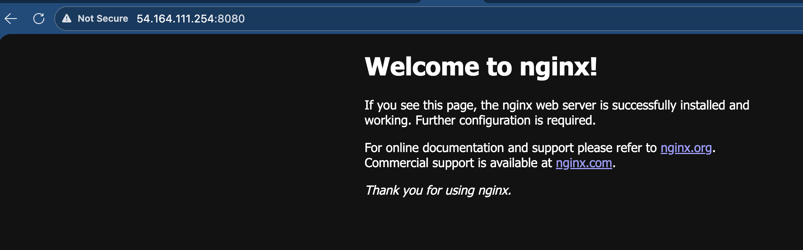
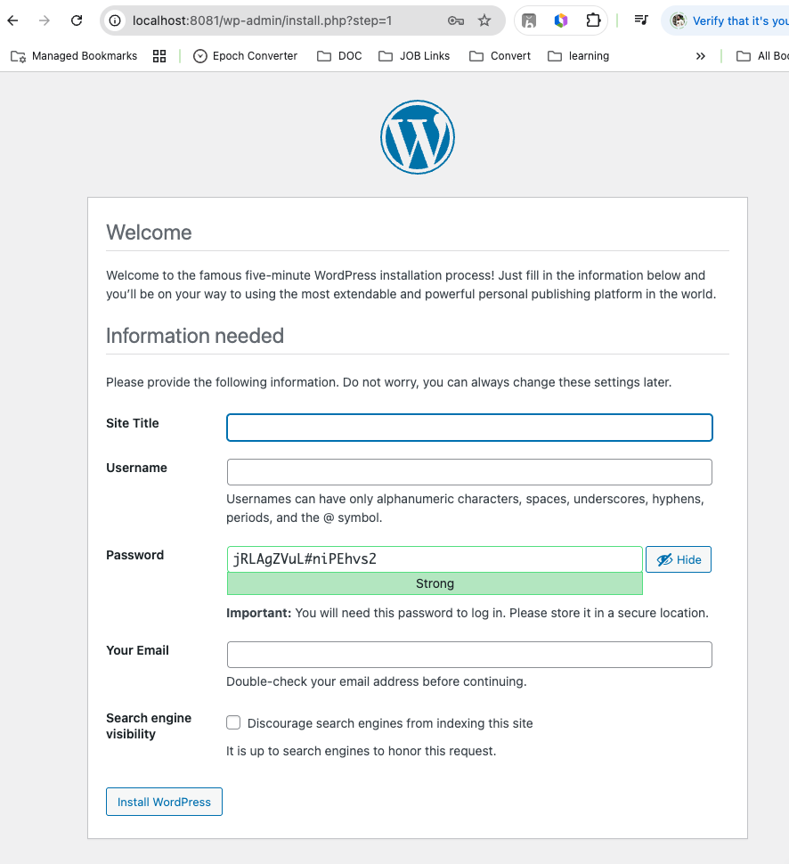

# Day 33 – Docker Compose: Multi-Container Basics

## Task 1: Install & Verify

### Step 1: Check Docker Compose

```bash
ubuntu@ip-172-31-17-136:~/Docker/project$ docker compose version
Docker Compose version v5.1.0
```

## Task 2: Your First Compose File

-> Create docker-compose.yml and execute `docker compose up -d` and `docker compose down`
```bash 
ubuntu@ip-172-31-17-136:~/Docker/project/docker-compose$ cat docker-compose.yml
version: "3"

services:
  nginx:
    image: nginx:latest
    ports:
      - "8080:80"
ubuntu@ip-172-31-17-136:~/Docker/project/docker-compose$ docker compose up -d
WARN[0000] /home/ubuntu/Docker/project/docker-compose/docker-compose.yml: the attribute `version` is obsolete, it will be ignored, please remove it to avoid potential confusion
[+] up 10/10
 ✔ Image nginx:latest               Pulled                                                                        3.9s
 ✔ Network docker-compose_default   Created                                                                       0.1s
 ✔ Container docker-compose-nginx-1 Started
ubuntu@ip-172-31-17-136:~/Docker/project/docker-compose$ docker compose down
WARN[0000] /home/ubuntu/Docker/project/docker-compose/docker-compose.yml: the attribute `version` is obsolete, it will be ignored, please remove it to avoid potential confusion
[+] down 2/2
 ✔ Container docker-compose-nginx-1 Removed                                                                       0.2s
 ✔ Network docker-compose_default   Removed
```



## Task 3: Two-Container Setup (WordPress + MySQL)
Write a `docker-compose.yml` that runs:
- A **WordPress** container
- A **MySQL** container

They should:
- Be on the same network (Compose does this automatically)
- MySQL should have a named volume for data persistence
- WordPress should connect to MySQL using the service name

Start it, access WordPress in your browser, and set it up.

**Verify:** Stop and restart with `docker compose down` and `docker compose up` — is your WordPress data still there?

Answare : 

```bash 
$cat docker-compose.yml                                                  
version: "3.8"
services:
  db:
    image: mysql:latest
    environment:
      MYSQL_ROOT_PASSWORD: root
      MYSQL_DATABASE: wordpress
    volumes:
      - db-data:/var/lib/mysql

  wordpress:
    image: wordpress:latest
    ports:
      - "8081:80"
    environment:
      WORDPRESS_DB_HOST: db
      WORDPRESS_DB_USER: root
      WORDPRESS_DB_PASSWORD: root
      WORDPRESS_DB_NAME: wordpress
    depends_on:
      - db

volumes:
  db-data:
  ```




## Task 4: Compose Commands
Practice and document these:
1. Start services in **detached mode**
2. View running services
3. View **logs** of all services
4. View logs of a **specific** service
5. **Stop** services without removing
6. **Remove** everything (containers, networks)
7. **Rebuild** images if you make a change

```bash 
docker compose up -d                                                                                                                                                                                                                    ─╯
WARN[0000] /Users/nilamadhabp/Desktop/Learning/docker/docker-compose.yml: the attribute `version` is obsolete, it will be ignored, please remove it to avoid potential confusion
[+] Running 3/3
 ✔ Network docker_default        Created                                                                                                                                                                                                 0.1s
 ✔ Container docker-db-1         Started                                                                                                                                                                                                 0.3s
 ✔ Container docker-wordpress-1  Started                                                                                                                                                                                                 0.4s

╭─    ~/Desktop/Learning/docker ───────────────────────────────────────────────────────────────────────────────────────────────────────────────────────────────────────────────────────────────────────────────── ✔  07:55:17 p.m.  ─╮
╰─ docker compose ps                                                                                                                                                                                                                       ─╯
WARN[0000] /Users/nilamadhabp/Desktop/Learning/docker/docker-compose.yml: the attribute `version` is obsolete, it will be ignored, please remove it to avoid potential confusion
NAME                 IMAGE              COMMAND                  SERVICE     CREATED         STATUS         PORTS
docker-db-1          mysql:latest       "docker-entrypoint.s…"   db          5 seconds ago   Up 4 seconds   3306/tcp, 33060/tcp
docker-wordpress-1   wordpress:latest   "docker-entrypoint.s…"   wordpress   5 seconds ago   Up 4 seconds   0.0.0.0:8081->80/tcp, [::]:8081->80/tcp

╭─    ~/Desktop/Learning/docker ───────────────────────────────────────────────────────────────────────────────────────────────────────────────────────────────────────────────────────────────────────────────── ✔  07:55:21 p.m.  ─╮
╰─ docker compose logs -f                                                                                                                                                                                                                  ─╯
WARN[0000] /Users/nilamadhabp/Desktop/Learning/docker/docker-compose.yml: the attribute `version` is obsolete, it will be ignored, please remove it to avoid potential confusion
db-1         | 2026-02-26 14:25:16+00:00 [Note] [Entrypoint]: Entrypoint script for MySQL Server 9.6.0-1.el9 started.
db-1         | 2026-02-26 14:25:16+00:00 [Note] [Entrypoint]: Switching to dedicated user 'mysql'
db-1         | 2026-02-26 14:25:16+00:00 [Note] [Entrypoint]: Entrypoint script for MySQL Server 9.6.0-1.el9 started.
db-1         | '/var/lib/mysql/mysql.sock' -> '/var/run/mysqld/mysqld.sock'
db-1         | 2026-02-26T14:25:16.803753Z 0 [System] [MY-015015] [Server] MySQL Server - start.
db-1         | 2026-02-26T14:25:17.021112Z 0 [System] [MY-010116] [Server] /usr/sbin/mysqld (mysqld 9.6.0) starting as process 1
db-1         | 2026-02-26T14:25:17.021128Z 0 [System] [MY-015590] [Server] MySQL Server has access to 2 logical CPUs.
db-1         | 2026-02-26T14:25:17.021139Z 0 [System] [MY-015590] [Server] MySQL Server has access to 6209081344 bytes of physical memory.
db-1         | 2026-02-26T14:25:17.027246Z 1 [System] [MY-013576] [InnoDB] InnoDB initialization has started.
db-1         | 2026-02-26T14:25:17.210155Z 1 [System] [MY-013577] [InnoDB] InnoDB initialization has ended.
db-1         | 2026-02-26T14:25:17.355137Z 0 [Warning] [MY-010068] [Server] CA certificate ca.pem is self signed.
db-1         | 2026-02-26T14:25:17.355159Z 0 [System] [MY-013602] [Server] Channel mysql_main configured to support TLS. Encrypted connections are now supported for this channel.
db-1         | 2026-02-26T14:25:17.356198Z 0 [Warning] [MY-011810] [Server] Insecure configuration for --pid-file: Location '/var/run/mysqld' in the path is accessible to all OS users. Consider choosing a different directory.
db-1         | 2026-02-26T14:25:17.367949Z 0 [System] [MY-010931] [Server] /usr/sbin/mysqld: ready for connections. Version: '9.6.0'  socket: '/var/run/mysqld/mysqld.sock'  port: 3306  MySQL Community Server - GPL.
db-1         | 2026-02-26T14:25:17.368210Z 0 [System] [MY-011323] [Server] X Plugin ready for connections. Bind-address: '::' port: 33060, socket: /var/run/mysqld/mysqlx.sock
wordpress-1  | WordPress not found in /var/www/html - copying now...
wordpress-1  | Complete! WordPress has been successfully copied to /var/www/html
wordpress-1  | No 'wp-config.php' found in /var/www/html, but 'WORDPRESS_...' variables supplied; copying 'wp-config-docker.php' (WORDPRESS_DB_HOST WORDPRESS_DB_NAME WORDPRESS_DB_PASSWORD WORDPRESS_DB_USER)
wordpress-1  | AH00558: apache2: Could not reliably determine the server's fully qualified domain name, using 172.28.0.3. Set the 'ServerName' directive globally to suppress this message
wordpress-1  | AH00558: apache2: Could not reliably determine the server's fully qualified domain name, using 172.28.0.3. Set the 'ServerName' directive globally to suppress this message
wordpress-1  | [Thu Feb 26 14:25:17.151458 2026] [mpm_prefork:notice] [pid 1:tid 1] AH00163: Apache/2.4.66 (Debian) PHP/8.3.30 configured -- resuming normal operations
wordpress-1  | [Thu Feb 26 14:25:17.151752 2026] [core:notice] [pid 1:tid 1] AH00094: Command line: 'apache2 -D FOREGROUND'
wordpress-1  | 172.28.0.1 - - [26/Feb/2026:14:25:39 +0000] "POST /wp-admin/install.php?step=1 HTTP/1.1" 200 2804 "http://localhost:8081/wp-admin/install.php" "Mozilla/5.0 (Macintosh; Intel Mac OS X 10_15_7) AppleWebKit/537.36 (KHTML, like Gecko) Chrome/134.0.0.0 Safari/537.36"
^C%

╭─    ~/Desktop/Learning/docker ───────────────────────────────────────────────────────────────────────────────────────────────────────────────────────────────────────────────────────────────────── INT ✘  59s   07:56:28 p.m.  ─╮
╰─ docker compose logs -f wordpress                                                                                                                                                                                                        ─╯
WARN[0000] /Users/nilamadhabp/Desktop/Learning/docker/docker-compose.yml: the attribute `version` is obsolete, it will be ignored, please remove it to avoid potential confusion
wordpress-1  | WordPress not found in /var/www/html - copying now...
wordpress-1  | Complete! WordPress has been successfully copied to /var/www/html
wordpress-1  | No 'wp-config.php' found in /var/www/html, but 'WORDPRESS_...' variables supplied; copying 'wp-config-docker.php' (WORDPRESS_DB_HOST WORDPRESS_DB_NAME WORDPRESS_DB_PASSWORD WORDPRESS_DB_USER)
wordpress-1  | AH00558: apache2: Could not reliably determine the server's fully qualified domain name, using 172.28.0.3. Set the 'ServerName' directive globally to suppress this message
wordpress-1  | AH00558: apache2: Could not reliably determine the server's fully qualified domain name, using 172.28.0.3. Set the 'ServerName' directive globally to suppress this message
wordpress-1  | [Thu Feb 26 14:25:17.151458 2026] [mpm_prefork:notice] [pid 1:tid 1] AH00163: Apache/2.4.66 (Debian) PHP/8.3.30 configured -- resuming normal operations
wordpress-1  | [Thu Feb 26 14:25:17.151752 2026] [core:notice] [pid 1:tid 1] AH00094: Command line: 'apache2 -D FOREGROUND'
wordpress-1  | 172.28.0.1 - - [26/Feb/2026:14:25:39 +0000] "POST /wp-admin/install.php?step=1 HTTP/1.1" 200 2804 "http://localhost:8081/wp-admin/install.php" "Mozilla/5.0 (Macintosh; Intel Mac OS X 10_15_7) AppleWebKit/537.36 (KHTML, like Gecko) Chrome/134.0.0.0 Safari/537.36"
^C%

╭─    ~/Desktop/Learning/docker ───────────────────────────────────────────────────────────────────────────────────────────────────────────────────────────────────────────────────────────────────────────── INT ✘  07:56:38 p.m.  ─╮
╰─ docker compose stop                                                                                                                                                                                                                     ─╯
WARN[0000] /Users/nilamadhabp/Desktop/Learning/docker/docker-compose.yml: the attribute `version` is obsolete, it will be ignored, please remove it to avoid potential confusion
[+] Stopping 2/2
 ✔ Container docker-wordpress-1  Stopped                                                                                                                                                                                                 1.4s
 ✔ Container docker-db-1         Stopped                                                                                                                                                                                                 1.6s

╭─    ~/Desktop/Learning/docker ────────────────────────────────────────────────────────────────────────────────────────────────────────────────────────────────────────────────────────────────────────── ✔  3s   07:56:58 p.m.  ─╮
╰─ docker compose down                                                                                                                                                                                                                     ─╯
WARN[0000] /Users/nilamadhabp/Desktop/Learning/docker/docker-compose.yml: the attribute `version` is obsolete, it will be ignored, please remove it to avoid potential confusion
[+] Running 3/3
 ✔ Container docker-wordpress-1  Removed                                                                                                                                                                                                 0.0s
 ✔ Container docker-db-1         Removed                                                                                                                                                                                                 0.0s
 ✔ Network docker_default        Removed                                                                                                                                                                                                 0.5s

╭─    ~/Desktop/Learning/docker ───────────────────────────────────────────────────────────────────────────────────────────────────────────────────────────────────────────────────────────────────────────────── ✔  07:57:13 p.m.  ─╮
╰─ docker compose up --build                                                     
```


## Task 5: Environment Variables

### Task 5: Environment Variables
1. Add environment variables directly in your `docker-compose.yml`
2. Create a `.env` file and reference variables from it in your compose file
3. Verify the variables are being picked up

```bash 
╭─    ~/Desktop/Learning/docker ───────────────────────────────────────────────────────────────────────────────────────────────────────────────────────────────────────────────────────────────────────────────── ✔  08:04:19 p.m.  ─╮
╰─ cat .env                                                                                                                                                                                                                                ─╯
MYSQL_ROOT_PASSWORD=root
╭─    ~/Desktop/Learning/docker ───────────────────────────────────────────────────────────────────────────────────────────────────────────────────────────────────────────────────────────────────────── ✔  37s   08:04:13 p.m.  ─╮
╰─ docker compose config                                                                                                                                                                                                                   ─╯
WARN[0000] /Users/nilamadhabp/Desktop/Learning/docker/docker-compose.yml: the attribute `version` is obsolete, it will be ignored, please remove it to avoid potential confusion
name: docker
services:
  db:
    environment:
      MYSQL_DATABASE: wordpress
      MYSQL_ROOT_PASSWD: root
    image: mysql:latest
    networks:
      default: null
    volumes:
      - type: volume
        source: db-data
        target: /var/lib/mysql
        volume: {}
  wordpress:
    depends_on:
      db:
        condition: service_started
        required: true
    environment:
      WORDPRESS_DB_HOST: db
      WORDPRESS_DB_NAME: wordpress
      WORDPRESS_DB_PASSWORD: root
      WORDPRESS_DB_USER: root
    image: wordpress:latest
    networks:
      default: null
    ports:
      - mode: ingress
        target: 80
        published: "8081"
        protocol: tcp
networks:
  default:
    name: docker_default
volumes:
  db-data:
    name: docker_db-data

```

## What I learned today

- Docker Compose helps manage multiple containers easily.
- It automatically creates networks and volumes.
- Service names act as DNS names.
- Environment variables make configuration flexible.
- Compose is very useful in real-world DevOps.