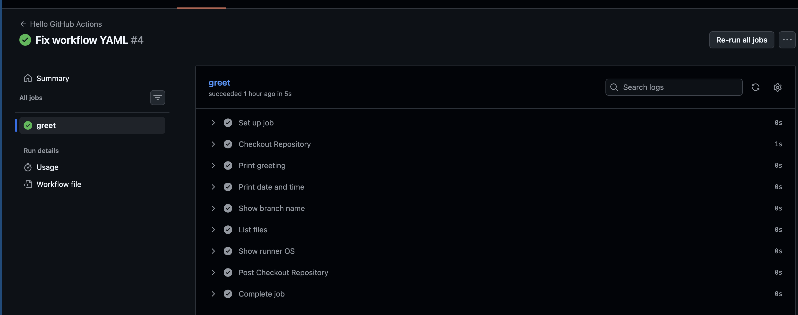

# Day 40 – First GitHub Actions Workflow

## Overview

Today I created my first CI workflow using GitHub Actions.  
The goal was to understand how CI pipelines automatically run when code is pushed to a repository.

---

# Workflow YAML

```yaml
name: Hello GitHub Actions

on:
  push:

jobs:
  greet:
    runs-on: ubuntu-latest

    steps:
      - name: Checkout Repository
        uses: actions/checkout@v4

      - name: Print greeting
        run: echo "Hello from GitHub Actions!"

      - name: Print date and time
        run: date

      - name: Show branch name
        run: echo "Branch name:" ${{ github.ref_name }}

      - name: List files
        run: ls -la

      - name: Show runner OS
        run: echo "Runner OS:" $RUNNER_OS
```

---

# Understanding Workflow Anatomy

### on:
Defines the event that triggers the workflow.  
In this pipeline it runs whenever code is pushed.

---

### jobs:
Defines the tasks that the workflow will execute.

---

### runs-on:
Specifies the environment where the job runs.  
Example: ubuntu-latest

---

### steps:
Steps represent individual actions inside a job.

---

### uses:
Calls a predefined GitHub Action.

Example:
```
uses: actions/checkout@v4
```

This action checks out the repository code to the runner.

---

### run:
Executes shell commands in the runner.

Example:
```
run: echo "Hello"
```

---

### name:
Provides a readable name for the step displayed in pipeline logs.

---

# Failed Pipeline Experiment

I intentionally added a failing command:

```
run: exit 1
```

This caused the pipeline to fail with a red status.

The logs clearly highlighted the failed step and displayed the error message, helping identify the issue.

---

# Key Learnings

1. GitHub Actions allows automation directly inside repositories.
2. Workflows are defined using YAML files.
3. Each workflow contains jobs and steps executed by runners.
4. Pipeline logs are useful for debugging failures.

---

# Screenshot



---

# Conclusion

This exercise demonstrated how CI pipelines automate tasks such as running scripts, building code, and validating changes before deployment.

---
