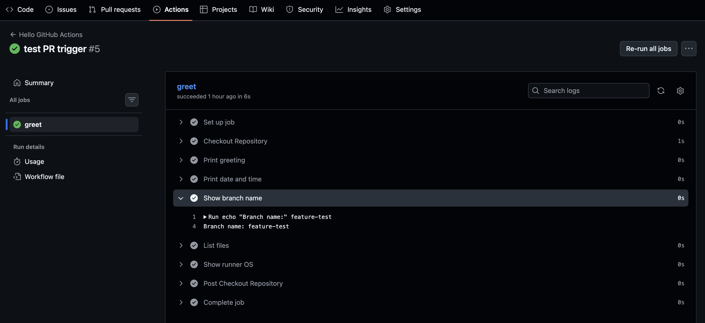
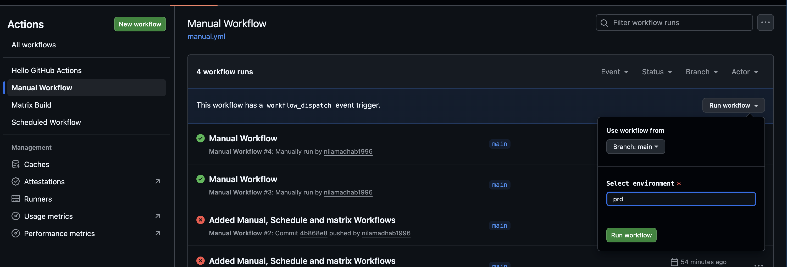
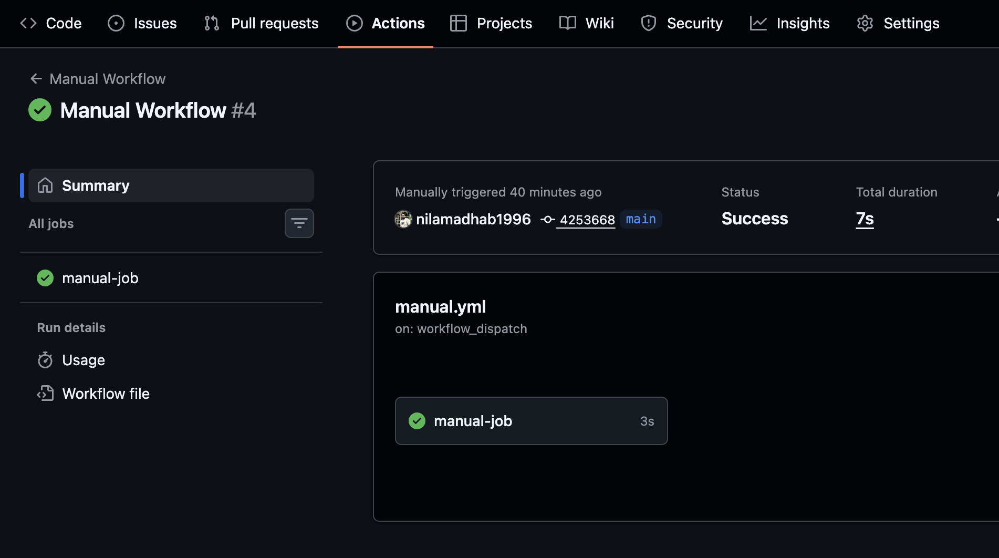
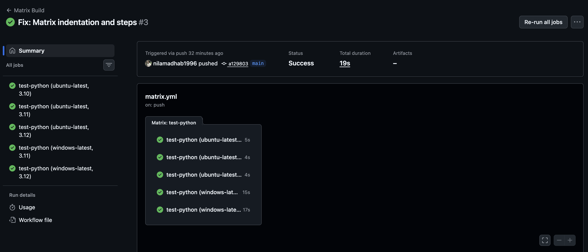

# Day 41 – Triggers & Matrix Builds

**Your pipeline runs on push. Today you learn **every way to trigger a workflow** and how to run jobs across multiple environments at once.**

---

## Task 1: Trigger on Pull Request
1. Create `.github/workflows/pr-check.yml`
2. Trigger it only when a pull request is **opened or updated** against `main`
3. Add a step that prints: `PR check running for branch: <branch name>`
4. Create a new branch, push a commit, and open a PR
5. Watch the workflow run automatically

pr-check.yml
```yml
name: PR Check

on:
  pull_request:
    branches: [main]
    types: [opened, synchronize, reopened]
    


jobs:
  pr-check:
    runs-on: ubuntu-latest

    steps:
      - name: Checkout Repository
        uses: actions/checkout@v4
      
      - name: Print PR branch name
        run: echo "PR Branch name:" ${{ github.head_ref }}
```

**SCREEN SHOT**



---

## Task 2: Scheduled Trigger
1. Add a `schedule:` trigger to any workflow using cron syntax
2. Set it to run every day at midnight UTC
3. Write in your notes: What is the cron expression for every Monday at 9 AM?

schedule.yml
```yml 
name: Scheduled Workflow

on:
  schedule:
    - cron: '0 9 * * *' #Run day at 9:00 PM 

jobs:
  scheduled-job:
    runs-on: ubuntu-latest  

    steps:
      - name: Checkout Repository
        uses: actions/checkout@v4
      
      - name: Print scheduled message
        run: echo "This workflow runs on a schedule!"
      
      - name: Print date and time
        run: date
```

---

## Task 3: Manual Trigger
1. Create `.github/workflows/manual.yml` with a `workflow_dispatch:` trigger
2. Add an **input** that asks for an `environment` name (staging/production)
3. Print the input value in a step
4. Go to the **Actions** tab → find the workflow → click **Run workflow**


manual.yml
```yml
name: Manual Workflow

on:
  workflow_dispatch:
    inputs:
      environment:
        description: 'Select environment'
        required: true
        default: 'stg'
        options:
          - prod
          - stg
          - dev

jobs: 
  manual-job:
    runs-on: ubuntu-latest

    steps:
      - name: Print selected environment
        run: echo "Selected environment:" ${{ github.event.inputs.environment }}
```

**SCREEN SHOT**




---

## Task 4 and 5 in One : 

### Task 4: Matrix Builds
Create `.github/workflows/matrix.yml` that:
1. Uses a matrix strategy to run the same job across:
   - Python versions: `3.10`, `3.11`, `3.12`
2. Each job installs Python and prints the version
3. Watch all 3 run in parallel

### Task 5: Exclude & Fail-Fast
1. In your matrix, **exclude** one specific combination (e.g., Python 3.10 on Windows)
2. Set `fail-fast: false` — trigger a failure in one job and observe what happens to the rest
3. Write in your notes: What does `fail-fast: true` (the default) do vs `false`?

matrix.yml
```yml
name: Matrix Build

on:
  push:

jobs:
  test-python:
    runs-on: ${{ matrix.os }}

    strategy:
      fail-fast: false
      matrix:
        os: [ubuntu-latest, windows-latest]
        python-version: ["3.10", "3.11", "3.12"]

        exclude:
          - os: windows-latest
            python-version: "3.10"

    steps:
      - name: Checkout repository
        uses: actions/checkout@v4

      - name: Setup Python
        uses: actions/setup-python@v5
        with:
          python-version: ${{ matrix.python-version }}

      - name: Show Python version
        run: python --version

      - name: Show OS
        run: echo "Running on ${{ matrix.os }}" 
```

Then extend the matrix to also include 2 operating systems — how many total jobs run now?
fail-fast behavior:

true → stop other jobs if one fails

false → continue running remaining jobs




---

### **Key Learnings**
1. Workflows can be triggered by push, pull requests, schedules, or manually.
2. Matrix builds allow testing across multiple environments.
3. Fail-fast controls how pipelines behave when a job fails.


