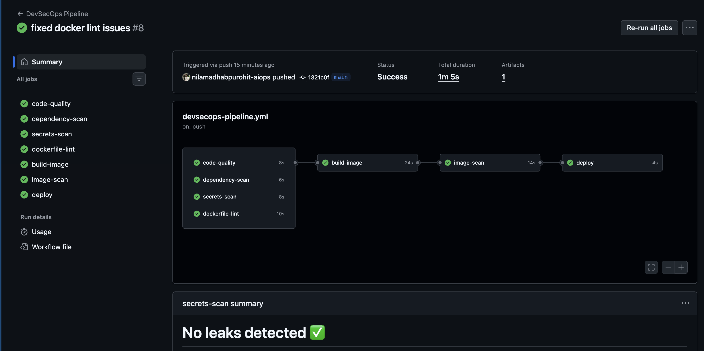

# Day 49 – DevSecOps Pipeline

## What is DevSecOps?

DevSecOps means integrating security checks directly into the CI/CD pipeline so vulnerabilities are detected early before reaching production.

Instead of security being a separate process, it becomes part of automation.

---

# Security Improvements Added

Dependency vulnerability scanning on PRs

Docker image vulnerability scanning using Trivy

GitHub secret scanning

Workflow permission restrictions

---

# Trivy Scan Result

The scan checks Docker images for known CVEs.

If CRITICAL or HIGH vulnerabilities are found the pipeline fails.

Base image used:
python:3.11-slim

---

# Secret Scanning Learning

Secret scanning detects exposed credentials automatically.

Push protection blocks commits containing secrets.

If an AWS key is leaked GitHub alerts the user and may notify AWS.

---

# Updated Secure Pipeline

PR opened
 → Build
 → Test
 → Dependency scan

Merge main
 → Build
 → Docker build
 → SBOM generation
 → Trivy scan
 → Image signing
 → Docker push
 → Deploy

Continuous protection:
 → Secret scanning
 → Dependency alerts
 → Code scanning alerts

---

## Advanced Security Enhancements

Added SBOM generation for supply chain visibility.

Added container image signing using Cosign.

Uploaded Trivy results to GitHub Security tab.

Pinned actions to specific versions to reduce supply chain risk.

These improvements make the pipeline closer to enterprise DevSecOps standards.

---

# Key Learnings

Security should be automated.

CI pipelines should block vulnerable builds.

Least privilege permissions reduce risk.

DevSecOps shifts security left.

---

# Conclusion

This exercise helped me understand how security can be integrated into CI/CD pipelines using automated scans and permission controls.
