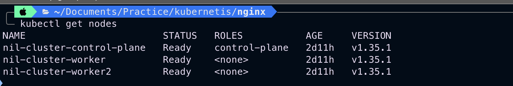
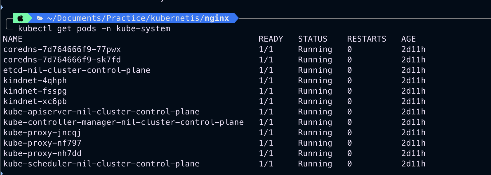

# Day 50 – Kubernetes Architecture and Cluster Setup

## Kubernetes History

Kubernetes was created by Google in 2014 to solve the problem of managing containers at scale. While Docker helps in creating and running containers, it does not provide features like auto-healing, auto-scaling, and orchestration across multiple servers. Kubernetes was inspired by Google's internal container orchestration system called Borg and was later donated to CNCF. The word Kubernetes means "Helmsman" or "Ship Pilot", which reflects its role in managing containerized workloads.

---

## Kubernetes Architecture Diagram

### Cluster Architecture (Text Diagram)

                Kubernetes Cluster
                       |
    -----------------------------------------
    |                                       |
  Control Plane                         Worker Node  
  Components:                           Components:
  1. API Server                         1. kubelet
  2. etcd                               2. kube-proxy
  3. Scheduler                          3. Container Runtime
  4. Controller                         4. Manager Pods


### Control Plane Components

API Server :
Acts as the entry point for all Kubernetes commands. All kubectl commands communicate with the cluster through the API server.

etcd :
A key-value database that stores all cluster information like pods, nodes, secrets, and configurations.

Scheduler :
Responsible for deciding which worker node should run a newly created pod based on resource availability.

Controller Manager :
Maintains the desired state of the cluster. If something fails, it tries to bring the cluster back to the desired state.

---

### Worker Node Components

kubelet :
Agent running on each node that communicates with the API server and manages pods.

kube-proxy :
Handles networking and ensures communication between pods and services.

Container Runtime :
Software responsible for running containers (example: containerd).

---

## Tool Used for Cluster Setup

I used **kind (Kubernetes in Docker)** to create the cluster.

### Reason:

- Lightweight and fast
- Uses Docker containers to create nodes
- Easy to create and delete clusters
- Good for DevOps practice environments
- Requires fewer resources compared to minikube

---

## Cluster Verification

### Nodes Status

Command used: `kubectl get nodes`



### kube-system Pods

Command used: `kubectl get pods -n kube-system`




---

## kube-system Pod Responsibilities

### kube-apiserver
Acts as the front end of Kubernetes. All REST operations and kubectl commands go through it.

### etcd
Stores all Kubernetes cluster data such as configuration, state, and metadata.

### kube-scheduler
Assigns pods to worker nodes based on resource requirements.

### kube-controller-manager
Ensures the cluster matches the desired state by managing controllers.

### CoreDNS
Provides DNS services inside the cluster so pods can communicate using service names.

### kube-proxy
Maintains network rules and enables communication between services and pods.

---

## Useful Commands Practiced

```bash
kubectl cluster-info
kubectl get nodes
kubectl get pods -A
kubectl get namespaces
kubectl describe node <node-name>
kubectl config current-context
kubectl config get-contexts
kubectl config view
kubectl get nodes -o wide
kubectl get pods -n kube-system -o wide
```


---

## What is kubeconfig?

kubeconfig is a configuration file used by kubectl to connect to Kubernetes clusters. It contains cluster details, user credentials, and contexts.

Default location: `~/.kube/config`


---

## Learning Outcome

Today I learned:

- Kubernetes architecture
- Control plane vs worker nodes
- How to create a local cluster using kind
- Basic kubectl commands
- Understanding kube-system components

This marks the beginning of my Kubernetes journey in the #90DaysOfDevOps challenge.