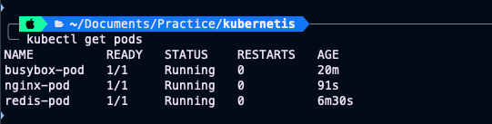

# Day 51 – Kubernetes Manifests and Your First Pods

## Kubernetes Manifest Structure

Every Kubernetes object is defined using a YAML manifest. There are four main required fields:

### apiVersion
Defines which Kubernetes API version to use.

Example: `apiVersion: v1`


Pods use v1 API.

---

### kind

Defines the resource type.

Examples:
```yml
kind: Pod
kind: Deployment
kind: Service
```

Today we used Pod.

---

### metadata

Defines identity information.

Contains:

- name → Pod name
- labels → key value tags
- namespace → logical grouping

Example:
```yml
metadata:
    name: nginx-pod
labels:
    app: nginx
```

---

### spec

Defines desired state.

Contains:

- containers
- images
- ports
- commands
- volumes

Example:
```yml
spec:
containers:
    name: nginx
    image: nginx:latest
```


Simple definition:

**spec = what you want Kubernetes to create**

---

# Pod Manifest 1 – Nginx Pod

File: nginx-pod.yaml
```yml
apiVersion: v1
kind: Pod

metadata:
  name: nginx-pod
  labels:
    app: nginx
    environment: dev

spec:
  containers:
  - name: nginx-container
    image: nginx:latest

    ports:
    - containerPort: 80
```

Commands used:

```bash
kubectl apply -f nginx-pod.yaml
kubectl get pods
kubectl describe pod nginx-pod
kubectl logs nginx-pod
kubectl exec -it nginx-pod -- /bin/bash
```

Result:

Pod successfully started and nginx welcome page verified.

---

# Pod Manifest 2 – BusyBox Pod

File: busybox-pod.yaml

```bash
apiVersion: v1
kind: Pod
metadata:
  name: busybox-pod
  labels:
    app: busybox
    environment: dev
spec:
  containers:
    - name: busybox
      image: busybox:latest
      command: ["sh", "-c", "echo Hello from BusyBox && sleep 3600"]
```


Commands:
```bash
kubectl apply -f busybox-pod.yaml
kubectl get pods
kubectl logs busybox-pod
```

Result:

Log output:
```bash
$ kubectl logs busybox-pod                                                                                 
Hello from BusyBox
```

Important learning:

BusyBox exits immediately without sleep command because it is not a long running container.

---

# Pod Manifest 3 – Redis Pod

File: redis-pod.yaml

```yml
apiVersion; v1
kind: pod
metadata:
  name: redis-pod
lebels:
  app: redis
  environment: test
  team: devops
spec:
  containers:
    - name: redis
      image: redis:letest
      ports:
       - containerPort: 6379
```

Commands:

```bash
kubectl apply -f redis-pod.yaml
kubectl get pods --show-labels
kubectl get pods -l app=redis
kubectl get pods -l team=devops
```

---

# Imperative vs Declarative Approach

### Imperative Approach

Command based.

Example:

```bash
kubectl run redis-pod --image=redis:latest
```

Characteristics:

- Quick testing
- Not reusable
- No version control
- Not production friendly

---

### Declarative Approach

YAML based.

Example:

```bash
kubectl apply -f nginx-pod.yaml
```

Characteristics:

- Version controlled
- Reusable
- Production standard
- GitOps friendly

---

# Key Difference

| Imperative | Declarative |
|------------|-------------|
| Command based | YAML based |
| Quick testing | Production approach |
| No tracking | Git tracking |
| Manual | Automated workflows |

---

# Screenshot – Running Pods

Command:


kubectl get pods


Output:
$ kubectl get pods      
NAME          READY   STATUS    RESTARTS   AGE
busybox-pod   1/1     Running   0          20m
nginx-pod     1/1     Running   0          91s
redis-pod     1/1     Running   0          6m30s



---

# What happens when standalone Pod is deleted?

Command:
```bash
kubectl delete pod nginx-pod
```

Result:

Pod is permanently deleted.

Reason:
- Pod has no controller managing it.
- Important concept:
- If this was a Deployment:
- Kubernetes would recreate it automatically.

Learning:

**Never run standalone pods in production**

Use:
- Deployment
- StatefulSet
- DaemonSet

---

# Important Commands Learned

```bash
kubectl get pods
kubectl get pods -o wide
kubectl describe pod nginx-pod
kubectl logs nginx-pod
kubectl exec -it nginx-pod -- /bin/sh
kubectl get pods --show-labels
kubectl get pods -l app=nginx
kubectl delete pod nginx-pod
```

---

# Learning Outcome

Today I learned:

- Kubernetes manifest structure
- Creating pods using YAML
- Pod debugging commands
- Imperative vs declarative model
- Labels and filtering
- Why standalone pods are not used in production

This is my first step toward mastering Kubernetes workloads.

#90DaysOfDevOps
#TrainWithShubham
#Kubernetes
#DevOps
